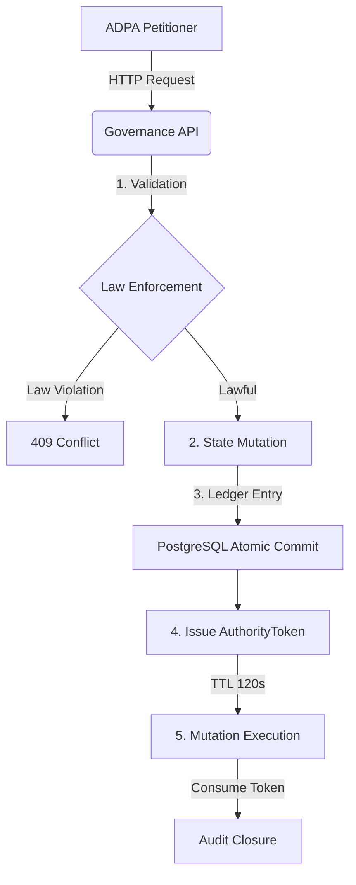
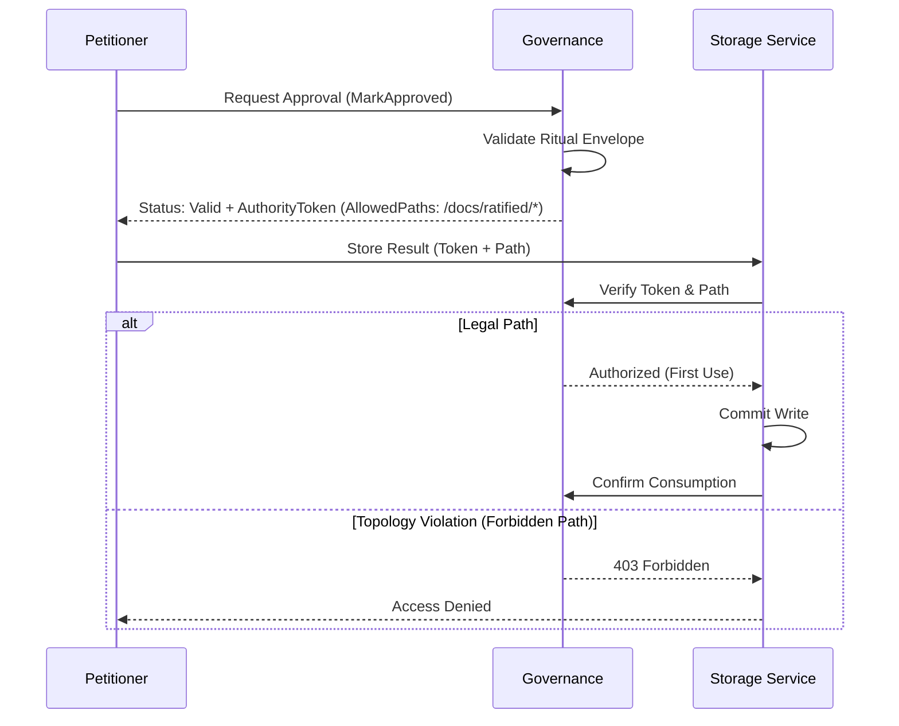

# External Certification Pack: RPAS Sovereign Governance

**Date:** April 15, 2026  
**Baseline:** CSR-42 (Sovereign extraction complete)  
**Status:** Certified & Closed  
**Audience:** Independent Technical Auditors and Governance Review Panels

---

## 1. Purpose & Scope
This Audit Brief defines the technical and jurisdictional "Constitution" of the RPAS Sovereign Governance Courthouse. Its purpose is to codify the non-violable structural properties that ensure the integrity of RPAS-CM rituals.

---

## 2. Threat Model (What This System Prevents)
The courthouse is designed to mechanically prevent the following failure modes:
- **Illegal State Transitions**: Attempts to approve or reject rituals without satisfying structural law.
- **Shadow Initiatives**: The creation of unrecorded state.
- **Double-Mutation & Replay**: Unauthorized re-execution of a successful ritual.
- **Topology Drift (G6)**: Mutations occurring outside authorized file system envelopes.
- **Authority Bypassing**: External applications (e.g., ADPA) attempting direct database access.

---

## 3. Constitutional Invariants (G1–G6)
- **G1 (Sovereign Authority)**: Authority is isolated; no external application has persistence access.
- **G2 (Law as Code)**: Rituals are encapsulated in immutable models with binary enforcement.
- **G3 (Atomic Execution)**: Validation *is* the mutation.
- **G4 (Audit Lineage)**: Every transition generates an append-only ledger entry.
- **G5 (Read vs Act)**: Separation of petitioner from authority.
- **G6 (Topology Enforcement)**: Mutations bound to ritual-specific file system envelopes.

---

## 4. Authority Chain

---

## 5. Write-Gates & Idempotency
- **Issuance**: Single-use `AuthorityToken` issued after successful commit.
- **TTL Constraint**: 120 seconds.
- **Consumption**: Atomic "on effect." Subsequent use triggers `409 Conflict`.

---

## 6. Topology Enforcement (G6)

## 7. Replay & Auditability
- **Determinism**: Identical petitions produce identical ledger entries, ensuring that the courthouse's memory is a perfect reflection of the petitioner's intent.
- **Audit Lineage**: Every successful validation creates a permanent record in the `governance_ledger` linking the Action, Entity, and the resulting AuthorityToken.

> [!NOTE]
> **Replay Safety**: Replay safety applies to lawful transitions only; unlawful petitions are intentionally non-replayable and result in distinct audit signals (409 Conflict).

---

## 8. CSR-42 Certification Statement
> **"We, the undersigned system governors, certify that the RPAS Sovereign Governance Courthouse is sealed. As of baseline CSR-42, all jurisdictional boundaries are enforced, all mutations are audit-logged, and the system is mechanically prevented from state drift."**

